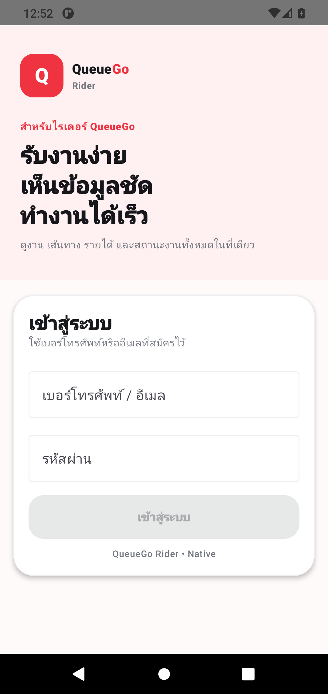

# Rider runtime evidence preparation — 2026-10-09

Rider Home Visual Gate remains **FAIL — matching mobile Web / authenticated Native evidence incomplete**. No measured UI defect or visual pass is inferred from the build.

## Preserved source and backup

- Fetched twice; working branch and remote agree at `9d87b234654b3c7b3d4235aaeda0098432d80953`, preserving Owner checkpoint94b297e and newer work.
- Backup `backup-native-before-rider-runtime-evidence-20261009` at9d87b23 exists locally and on GitHub before the QA workflow change.
- No Android application source, Production web, Supabase schema/RPC/RLS/state-machine, main or data mutations in this batch.

## Actual local verification

Installed official Android SDK packages with repository archive size/SHA1 verification: platform-tools37.0.1, platform36 revision2, build-tools36.0.0, emulator37.2.12 and AOSP API30/x86_64 revision10. Installed isolated Ubuntu JDK17.0.20.1 (official SHA256 verified) and Gradle9.6.0 (SHA256 `bbaeb2fef8710818cf0e261201dab964c572f92b942812df0c3620d62a529a01`). No global apt permissions, TLS verification, SELinux or network protections were disabled.

An initial incremental build found duplicate Rider dex R classes and three stale CustomerHomeBlueprintTest methods with NoSuchMethodError. That test class is absent from current source. Cleaned only generated outputs, without editing app/tests, then ran:

```text
gradle --no-daemon --no-build-cache --rerun-tasks --no-parallel --max-workers=2 clean
  :shared:testDebugUnitTest :customer:testDebugUnitTest :rider:testDebugUnitTest
  :customer:assembleDebug :merchant:assembleDebug :rider:assembleDebug
BUILD SUCCESSFUL in 1m 22s;148 actionable tasks:148 executed
```

| Verification | Actual result |
| --- | --- |
| npm regression | PASS, process exit0 |
| Native source integrity |191 checks,0 failures |
| Launcher assets |61 checks,0 failures |
| Production category assets |12 checks,0 failures |
| Shared JVM |13 tests,0 failures/errors |
| Customer JVM |31 tests,0 failures/errors |
| Rider JVM |19 tests,0 failures/errors |
| Customer/Merchant/Rider builds |PASS, fresh generated outputs |
| Source No WebView / whitespace |PASS |

Local debug APK fingerprints (verification records, no Owner APK delivery):

- Customer: `0ae2764a8c7f3c9bce0f8b8556007b2d2fe618c506aa7fbbe039935125fad26c`
- Merchant: `9fe86af86de1457ac6e922e6bd75dc3133afd59a3cbd247d8e3202c7970ac7be`
- Rider: `c9abb4b40c05c3abdf4a52a253caef883ce13f4b0e8c048cdebc69de9ce3dfe8`

## Local runtime attempt and CI alternative

/dev/kvm is absent. Created a genuine Pixel4 AOSP API30 AVD at1080×2280px/440dpi, without injecting app data, offers, GPS or credentials. Initial same-AVD lock was avoided with a new dedicated AVD. Software startup then exhausted45 boot checks. A second read-only diagnostic attempt exhausted18 checks: ADB moved offline→online; logs show zygote verification, PackageManager and SystemUI starting, but sys.boot_completed never reached1. Rider was not installed/launched/captured in these attempts; no Native screenshot is invented.

[GitHub's runner documentation](https://docs.github.com/en/actions/reference/runners/github-hosted-runners?productId=actions&versionId=free-pro-team@latest) confirms Android hardware acceleration support on hosted Linux. Added an accelerated CI step after existing regression/JVM/build/No WebView gates. It gives only the ephemeral runner user access to its KVM device if necessary, uses the official SDK, and requires completed Android boot before installing the actual freshly built Rider APK.

The capture checks process/resumed activity/runtime crash log and real accessibility login text, then saves an unmodified device screenshot, metrics and commit/APK/image digests. It enters no credentials, manufactures no state and makes no order/online/photo/support actions. Evidence is an internal14-day CI artifact. **Fresh-session login smoke PASS is not Home/Offer/Active/Pickup/Delivery visual parity, Production E2E or physical-device FCM.** No new app feature/backend is introduced.

Accelerated CI [37929722268](https://github.com/chatchairins-source/QueuGo/actions/runs/37929722268) at292df52 passed the original regression/assets/JVM/three-build/No WebView gates but **FAILED before Android boot**. Its actual artifact11615598142 contains `Unknown AVD name`: command-line tools and emulator resolved different default Android user homes. This is a runtime-infrastructure failure, not evidence of an application crash.

Fix9865346 explicitly shares a run-scoped `ANDROID_AVD_HOME` registry across the official tools and asserts its AVD index exists before launch. Actual local tool verification PASS: avdmanager created the index and emulator `-list-avds` resolved the same AVD. No system home/global SDK setting was changed and no app state was injected. Full replacement CI [37932248613](https://github.com/chatchairins-source/QueuGo/actions/runs/37932248613) at9865346 **PASS**, including actual Android boot, install, launch, accessibility and screenshot checks. Local npm regression/source191/launcher61/category12/whitespace PASS.

## Remaining release blockers

- Matching mobile Production browser viewport is still unavailable through the documented browser API; existing1363×936 desktop frame is not mobile evidence.
- Need a permitted actual Rider session on the Native runtime and real authorized job states for the five Rider comparison pairs. Browser secrets/JWTs were not exported.
- Customer/Merchant pairs, normal/Market/Laundry real Production E2E, physical FCM/background/offline/session recovery and P0/P1 clearance remain unverified. Existing Firebase config absence is not cured by emulator screenshots.
- No APK/RC/Pilot/Play readiness claim or Owner delivery. Continue Rider-first; VoIP remains deferred.

## Actual accelerated Native launch evidence



Captured2026-10-09T12:52:44.750352Z on real Android API30 emulator at1080×2280px/440dpi. Inspected the unmodified frame: QueueGo Rider branding, Thai login copy, credential fields and disabled login action are rendered; not an empty page. No credentials were entered. Cold activity launch Status:ok, TotalTime2902ms; no FATAL EXCEPTION and empty crash buffer. This verifies only the observed launch, not all runtime flows.

- CI artifact11616627950 ZIP SHA256: `d22be3449bb915663dca1469a0288d8f5515212f1421a5791158c7f41e22ecaa`; checked against retrieved ZIP bytes.
- Actual Rider APK SHA256: `ad43817f0ca07b500f3fe0ad0b85039e1f75877669885abf51cd8a182fcff2d3`.
- Unmodified PNG SHA256: `2999f0951c11308e8fadad7901bd01c73e8bc8cb1ee383b7954bff2c97aa33fc`; verified against [capture metadata](evidence/rider-native-login-9865346.json), source986534696b8970d2a125fb695699ef001e7f426e.

**Home/Offer/Active/Pickup/Delivery Visual Gate remains FAIL — missing matching authenticated mobile Web/Native pairs.** Physical FCM and Production E2E remain unverified. No APK delivered.
