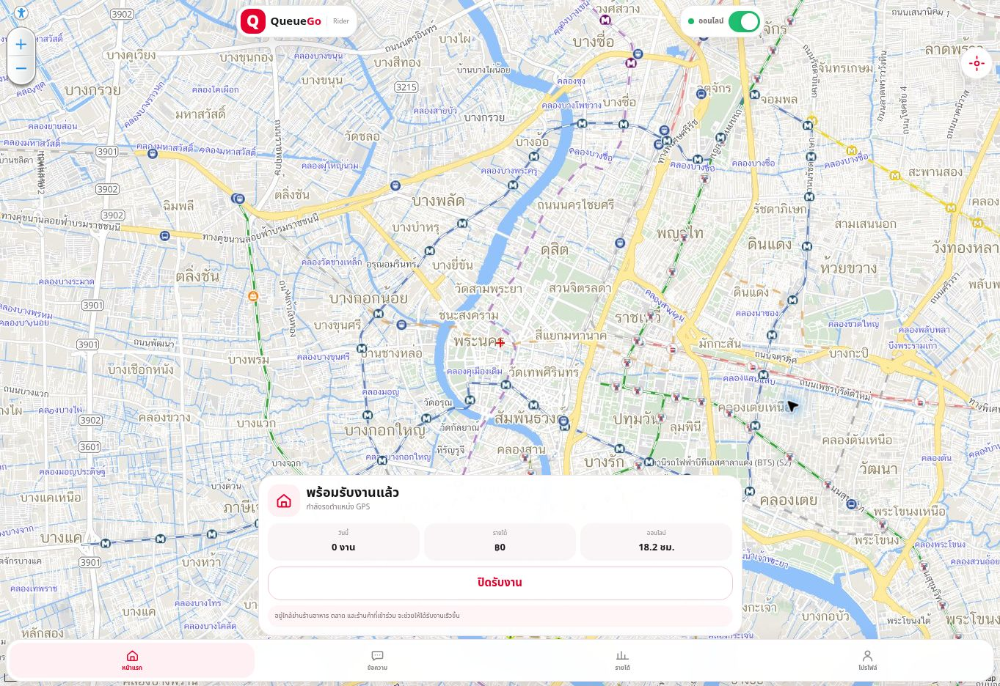

# Rider visual release gate — actual evidence, 2026-10-09

Status: **FAIL — comparison evidence incomplete**, not a claim of a demonstrated Native rendering defect.

## Source and state

- Fetched working branch and fast-forwarded to `aa22b1830f122b495ff4b6e9a781435b7e8df6cc`; it contains Owner checkpoint `94b297e2bdc08efcc33507f50cf0aa58bae8bf10`. No reset/revert/main merge.
- Actual CI [37917468824](https://github.com/chatchairins-source/QueuGo/actions/runs/37917468824) reports success at aa22b18. This is regression/build evidence, not a visual or physical-device FCM pass.
- Backup: `backup-native-before-rider-visual-evidence-20261009` at aa22b18.
- Opened actual https://chatchairins-source.github.io/QueuGo/rider/ and authenticated through secure browserAuth. Verified signed-in rendered Home and real Longdo tiles. No credential/session values inspected or stored in this report.

## Captured Home evidence

Measured browser viewport: **1363 × 936 CSS px, DPR 1**. This is explicitly a desktop reference; it must not substitute for mobile evidence. No crop/rescale is presented as a mobile rendering.

Observed: full-area Longdo map, floating Q/QueueGo/Rider branding, separate online status control at top, recenter at right, bottom job dock above four-tab fixed navigation. Online idle state displays actual zero-job/earnings summary and GPS-unavailable state; no offer or order was fabricated. No online/offline/job action was performed. Map location in this frame is not verified Rider GPS; browser reports GPS unavailable.

## Required pairs

| Screen | Mobile web screenshot | Native screenshot at matching size/state | Side-by-side | Gate |
| --- | --- | --- | --- | --- |
| Home map | Missing; desktop reference captured | Missing | Missing | FAIL |
| Targeted offer/countdown/expiry | Missing real offered state | Missing | Missing | FAIL |
| Active job | Missing real active state | Missing | Missing | FAIL |
| Pickup/check/photo | Missing real pickup state | Missing | Missing | FAIL |
| Delivery/check/photo | Missing real delivery state | Missing | Missing | FAIL |

Market multi-stop, Laundry, Messages, Earnings, Profile and Support remain pending after these core pairs. Every comparison must include geometry, map viewport, dock expansion, controls, navigation/safe areas, text/icons, spacing/radius/shadows and loading/empty/error/disabled/modal/keyboard/scroll states from Owner's checklist.

## Concrete runtime constraints

- Runtime follow-up: official SDK/adb/emulator, API30 system image, private JDK17 and checksum-verified Gradle9.6 are now installed. A clean, cache-disabled local build passes all three apps and63 JVM tests. /dev/kvm remains absent; software boot failed to reach boot complete in45 checks, then18 diagnostic checks (ADB became online, framework startup remained incomplete). No Native Home/session capture is available. See [runtime checkpoint](rider-runtime-checkpoint-20261009.md). Accelerated CI launch capture is added and awaits an actual run; its fresh-session login frame cannot substitute for Home comparison.
- Current browser API exposes screenshots and page interaction, but no documented mobile viewport/emulation setter. Attempted browser UI DevTools shortcut once; viewport/state stayed unchanged. Do not use injected CSS, crops, standalone browser automation or fake data as a substitute.
- Need a permitted mobile browser viewport and an Android test runtime with an actual Rider session and authorized real order states to produce the five pairs. Do not extract browser credentials/JWTs to provision Native.

No source-driven UI edits in this evidence batch: without the requested matching pair, claiming or fixing a pixel mismatch would be speculative. Keep Rider-first ordering; do not redirect to VoIP or unrelated feature work. Existing Floating Q requirement remains in release scope.

## Icons

Inspected existing `../branding/family-preview.png`: all three actual vectors share red/white Q geometry and role motifs (utensils/storefront/wheel-flame); small-size samples and adaptive circular masks are in that preview. No icon redesign in this batch. Physical-device launcher readability/masks remain unverified; no Owner approval is inferred.

## Release constraints

No Production web/DB/RLS/RPC/state-machine mutation, no fake E2E, no APK delivered. Visual gate cannot pass from CI/source review. Normal/Market/Laundry Production E2E follows core visual gates; physical-device FCM/background/reconnect and P0/P1 clearance remain unverified. Owner APK/RC/Pilot/Play readiness is blocked until all required gates pass.
